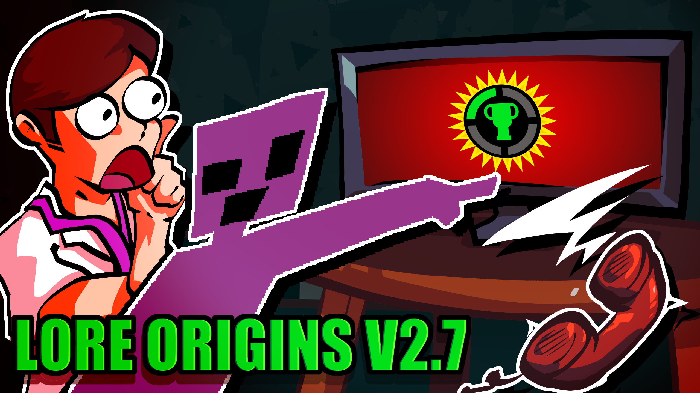

# LORE ORIGINS DOES IT AGAIN WITH A v2.7 UPDATE !!!

VISIT THE OFFICIAL WEBSITE (https://loreorigins.neocities.org) OR DOWNLOAD LORE ORIGINS NOW ON GAMEBANANA (https://gamebanana.com/mods/476070) or on this Github page by checking out the release page of the most recent pushed version

## WHAT IS LORE ORIGINS?

Lore Origins is an FNF mod that regroups the entire lore multiverse. The original track, made by LEX3X (aka kiwiquest), got so much praized for its authenticity and has become one of the most remixed song ever composed. This mod is an honor to this wonderful track that, basically, changed my life (for the better... or worse...).

This collection of lore remixes are repurposed for its original cast of singers, Ourple Guy, Matpat and Phone Guy, as an hope to fix the multiple parallel universes that those songs created...



## THIS V2.7 UPDATE INTRODUCES...

 - WIDESCREEN SUPPORT!!
   --> Gone are the Ourple variants, now, the skins affects ALL the cast. (Phone Guy only has 2 skins but whatever, i don't have the budget to make one myself)
 - NEW ORIGINAL MIX : Youtube
 - And more bugfixes and such.

## COMPILATION GUIDE


### Prerequisites
- [Haxe 4.3.6](https://haxe.org/download/)
- [Git](https://git-scm.com/downloads)

### The compiled executables will be available in the `export` directory.

### Windows
1. Install [Visual Studio Community](https://visualstudio.microsoft.com/vs/community/) with the following components:
   - Microsoft Visual Studio C++ build tools
   - Windows 10 SDK
  
   ```Note: or try running 'setup/setup-msvc-win.bat' simply.```
2. Run `setup/setup-windows.bat` to install required libraries
3. To compile, run one of:
   ```bat
   art/build_x64.bat          # 64-bit Release
   art/build_x64-debug.bat    # 64-bit Debug
   art/build_x32.bat          # 32-bit Release
   ```

### Linux/Mac
1. Install required packages:
   ```sh
   # Ubuntu/Debian
   sudo apt-get install g++ gcc libgl1-mesa-dev libglu1-mesa-dev
   
   # macOS
   brew install gcc
   ```
2. Run setup script:
   ```sh
   chmod +x setup/setup-unix.sh
   ./setup/setup-unix.sh
   ```
3. Compile using:
   ```sh
   lime build linux # For Linux
   lime build mac   # For macOS
   ```

### HTML5/Browser
Run one of:
```bat
art/build_html.bat         # Release build
art/build_html-debug.bat   # Debug build
```

### Troubleshooting
If you encounter compilation issues, check the required library versions at:
[Libraries Versions Guide](https://github.com/LORAY-guy/Lore-Origins/wiki/Libraries-Versions)